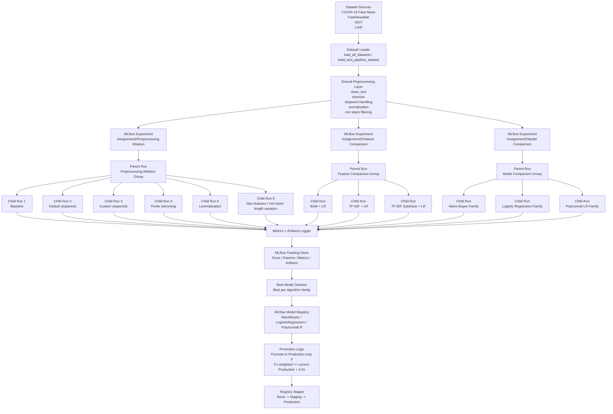

# Task 6 — MLflow Experiment Tracking Architecture

## Purpose

This document defines the MLflow experiment hierarchy **before implementation** for Task 6. It covers the required run groups:

- Preprocessing Ablation
- Feature Comparison
- Model Comparison

It also shows how best models are registered and automatically promoted from **Staging** to **Production**.

---

## Architecture Diagram

---

## Experiment Hierarchy

### 1. Preprocessing Ablation

- **Experiment name:** `Assignment2/Preprocessing Ablation`
- **Parent run:** `preprocessing_ablation_group`
- **Nested child runs:** 6 required configurations

Each child run varies at least one of:
- stopword list
- stemming / lemmatization
- min token length
- TF-IDF `max_features`

### 2. Feature Comparison

- **Experiment name:** `Assignment2/Feature Comparison`
- **Parent run:** `feature_comparison_group`
- **Nested child runs:** one per feature representation

Suggested child runs:
- BoW + Logistic Regression
- TF-IDF + Logistic Regression
- TF-IDF with sublinear TF + Logistic Regression

### 3. Model Comparison

- **Experiment name:** `Assignment2/Model Comparison`
- **Parent run:** `model_comparison_group`
- **Nested child runs:** one per algorithm family

Suggested child runs:
- Naive Bayes family
- Logistic Regression family
- Polynomial Logistic Regression family

---

## Required Logging Contract

Every run logs the following **parameters**:

- dataset sources
- train size
- test size
- tokenizer
- stopword list
- normalization method
- vectorizer settings
- model type

Every run logs the following **metrics**:

- accuracy
- per-class precision
- per-class recall
- per-class F1
- weighted F1
- ROC-AUC
- training time

Every run logs the following **artifacts**:

- confusion matrix image
- ROC curve image
- TF-IDF vocabulary file
- classification report text file

---

## Model Registry Policy

The best-performing model from each algorithm family is registered under a distinct registry name:

- `FakeNewsNaiveBayes`
- `FakeNewsLogisticRegression`
- `FakeNewsPolynomialLR`

---

## Automated Promotion Policy

Promotion from **Staging** to **Production** is allowed only if:

- candidate `weighted_f1 >= current_production_weighted_f1 + 0.01`

Interpretation:
- a candidate must beat the current Production model by **at least 1 percentage point** in weighted F1.
- if no Production model exists yet, the candidate can be promoted directly.

---

## Outputs Produced by This Architecture

- MLflow experiments with nested run groups
- preprocessing ablation comparison table
- parallel coordinates plot for preprocessing ablation
- registered best models for each family
- reproducible version history for API consumption in Task 7
