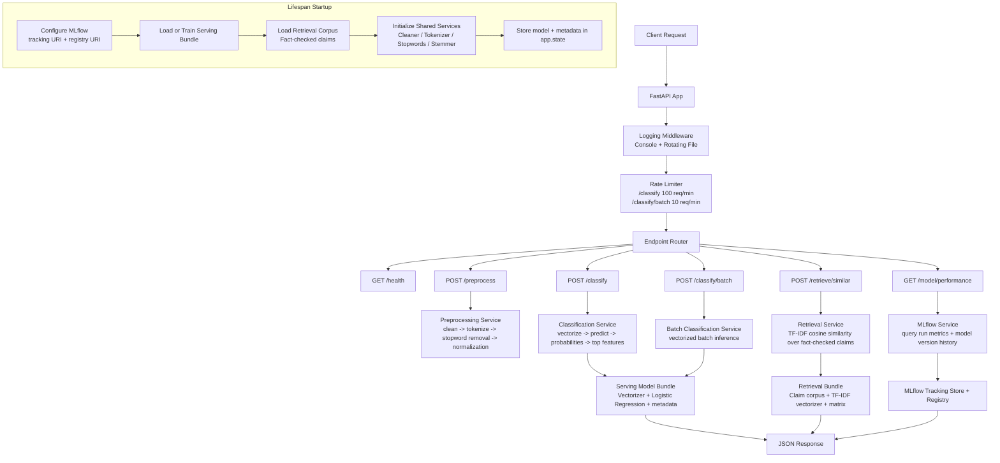

# Task 7 — FastAPI Inference System Architecture

## Purpose

This document defines the FastAPI inference architecture **before implementation** for Task 7. It covers:

- startup model loading via lifespan context manager
- request logging middleware
- rate limiting
- preprocessing, classification, batch inference, retrieval, and model performance endpoints
- MLflow integration for live metrics and version history

---

## Architecture Diagram

---

## Core Components

### 1. Lifespan Startup Loader

The model is loaded **once** at startup and stored in `app.state`.

Startup responsibilities:
- configure MLflow tracking and registry URIs
- load the Production-serving model bundle if available
- train and bootstrap a baseline bundle if no serving artifact exists
- build the retrieval corpus from fact-checked claims
- initialize reusable NLP services

### 2. Logging Middleware

Each request is logged to:
- console
- rotating log file

Logged fields:
- HTTP method
- path
- response status code
- processing time in ms
- client host

### 3. Rate Limiter

Path-specific in-memory rate limits:
- `/classify`: 100 requests/minute
- `/classify/batch`: 10 requests/minute

### 4. Shared NLP Services

Reusable services initialized once:
- `TextCleaner`
- `TokenizerComparer`
- `StopwordManager`
- `StemLemmatizerComparer`

### 5. Serving Model Bundle

The serving bundle contains:
- trained vectorizer
- trained classifier
- label mapping
- model name
- model version
- model stage
- weighted F1
- MLflow run ID
- load timestamp

### 6. Retrieval Bundle

The retrieval bundle contains:
- fact-checked claim corpus
- retrieval TF-IDF vectorizer
- retrieval matrix
- associated labels / sources / metadata

---

## Endpoint Mapping

### `GET /health`
Returns:
- model name
- model version
- stage
- weighted F1
- load timestamp

### `POST /preprocess`
Input:
- text
- processing steps

Returns:
- tokens
- removed stopwords
- processing time

### `POST /classify`
Input:
- text

Returns:
- prediction
- confidence
- class probabilities
- top contributing features

### `POST /classify/batch`
Input:
- up to 100 texts

Returns:
- batch predictions
- total batch processing time

### `POST /retrieve/similar`
Input:
- text
- `top_k`

Returns:
- top-k similar fact-checked claims
- cosine similarity scores

### `GET /model/performance`
Returns live information from MLflow:
- current serving model metrics
- version history
- best family models
- recent run summaries

---

## Validation Rules

### Text input
- minimum length: 10
- maximum length: 10,000

### `top_k`
- minimum: 1
- maximum: 20

### Batch size
- maximum 100 texts per `/classify/batch`

---

## Performance Targets

The architecture is designed to satisfy:

- `/classify < 100ms`
- batch of 10 texts `< 200ms`
- full `/classify/batch` request supports up to 100 texts
- assignment target: full batch under 500ms

This is achieved by:
- loading the model only once at startup
- using shared in-memory vectorizer and classifier objects
- vectorizing the entire batch at once
- avoiding retraining or disk I/O during request handling

---

## Testing Strategy

`test_api.py` will use:
- `pytest`
- `httpx`
- ASGI lifespan-aware integration testing

Coverage includes:
- all six endpoints
- validation failures
- rate-limit behavior
- edge cases
- response-time assertions

---

## Relationship to Task 6

Task 7 depends on Task 6 in two ways:

1. the serving model metadata comes from MLflow-logged experiments and registered models
2. `/model/performance` reads live metrics and version history directly from MLflow

This allows the inference system to expose both prediction functionality and MLOps traceability.
